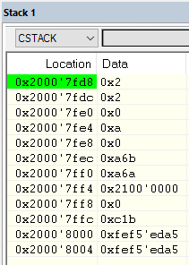

# SISTEMAS EMBARCADOS

A atividade a seguir é referente a um exercício realizado para a matéria de Sistemas Embarcados, pertencente ao curso de Engenharia Eletrônica da UTFPR.
Para a realização destes experimentos usaremos a seguinte placa de desenvolvimento: https://www.ti.com/tool/EK-TM4C1294XL

### PROFESSOR

Hugo Vieira Neto

### LABORATÓRIO_02

Exercícios sobre exceções.

## Exercício Prático 1

Conforme foi solicitado no exercício, a partir da área de trabalho “EK-TM4C1294XL_IAR8”, foi selecionado o projeto “simple_io_main_sp”.

Foi colocado um breakpoint na primeira instrução da função SysTick_Handler (na janela Disassembly) e o programa foi executado até parar na instrução requisitada, conforme a imagem a seguir:

A seguir é possível ver qual foi o conteúdo do topo da pilha:

Pode-se observar, conforme a figura abaixo, que os quatro primeiros estados salvos vieram dos registradores R0, R1, R2 e R3. Como no topo da pilha observa-se o estado de R0 e assim por diante, temos que os registradores foram salvos de acordo com a seguinte ordem: R3, R2, R1 e R0.

## Exercício Prático 2

Conforme solicitado, definiu-se o o símbolo __FPU_USED em Options → C/C++ Compiler → Preprocessor para usar a FPU.

Foram declaradas variáveis do tipo float e feitas operações com elas dentro da função main, para garantir que a FPU fosse utilizada para efetuá-las.

Foi colocado um breakpoint na primeira instrução da função SysTick_Handler (na janela Disassembly) e o programa foi executado até parar na instrução requisitada, conforme a imagem a seguir:

Os valores dos registradores CONTROL e LR solicitados são respectivamente 0 e 0xfffffff9, conforme podemos observar na figura seguinte:

O ponteiro de pilha que está sendo usado foi o SP_main (0x20007f90), conforme pode-se observar a seguir:

O bit NMIPENDSET do registrador ICSR (System Control Block) foi alterado de 0 para 1, conforme solicitado para exceção, e o programa foi executado novamente.

Antes:

Depois:

Com isso, o programa acaba tendo um bug, já que sua execução fica em loop.

Os valores dos registradores CONTROL e LR solicitados são 0 e 0xfffffff1, respectivamente.

## Exercício Prático 3

Os procedimentos do exercício prático 3 foram refeitos.

Mudou-se a FPU novamente conforme a figura a seguir:

Desta vez, os valores dos registradores CONTROL e LR são, 0 e 0xffffffe9, respectivamente, conforme podemos observar na figura seguinte.

A ARM CPU tem, na verdade, dois ponteiros de pilha, a SP_main e a SP_process, mas apenas um deles é visível como SP, dependendo do estado interno da CPU. Enquanto com o “Current CPU Registers” do depurador é possível visualizar apenas SP, na “CPU Registers” do depurador é possível visualizar a SP_main e a SP_process.

