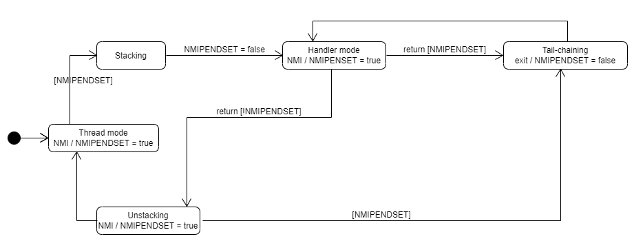
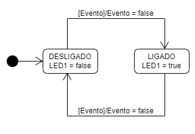

# SISTEMAS EMBARCADOS

A atividade a seguir é referente a um exercício realizado para a matéria de Sistemas Embarcados, pertencente ao curso de Engenharia Eletrônica da UTFPR.
Para a realização destes experimentos usaremos a seguinte placa de desenvolvimento: https://www.ti.com/tool/EK-TM4C1294XL

### PROFESSOR

Hugo Vieira Neto

### LABORATÓRIO_03

Exercícios sobre Implementação de Máquinas de Estados.

## Exercício 1 (Teórico)

Conforme foi solicitado no exercício, foi esboçado um diagrama de estados que modela o comportamento dinâmico das trocas de modo de operação de um núcleo ARM Cortex-M4, conforme a figura a seguir:

Foi considerada apenas a situação de operação em que os registradores especiais PRIMASK = 1, FAULTMASK = 1 e CONTROL = 0.

## Exercício 2 (Seleção por Estado)

Conforme solicitado, foi esboçado um diagrama de estados que descreve o comportamento dinâmico do projeto “fsm_states”.

## Exercício 3 (Seleção por Estado)

Conforme solicitado, o projeto “fsm_event” foi alterado de forma a apresentar a sequência crescente do Código de Gray de 3 bits nos LED D1, D2 e D3 do kit EK-TM4C1294XL.

## Exercício 4 (Seleção por Matriz)

Para este último exercício, foi feito um diagrama de estados que utiliza o conceito de hierarquia para descrever o comportamento dinâmico do projeto “fsm_matrix”, conforme a figura a seguir:

## Site utilizado para realização desta atividade

http://www.umlet.com/umletino/umletino.html