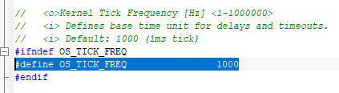
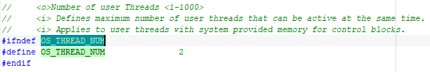
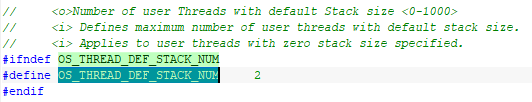
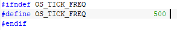
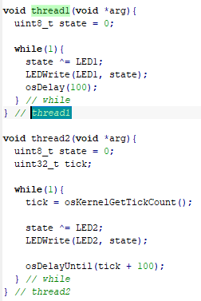
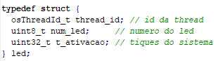

# SISTEMAS EMBARCADOS

A atividade a seguir é referente a um exercício realizado para a matéria de Sistemas Embarcados, pertencente ao curso de Engenharia Eletrônica da UTFPR.
Para a realização destes experimentos usaremos a seguinte placa de desenvolvimento: https://www.ti.com/tool/EK-TM4C1294XL

### PROFESSOR

Hugo Vieira Neto

### LABORATÓRIO_04

A partir de agora será utilizada a área de trabalho “EK-TM4C1294_RTOS_IAR9”.

### Exercício 2

Exercícios sobre múltiplas instâncias de uma mesma tarefa com comportamentos diferentes em função dos parâmetros passados na sua criação.

## Exercício 2.1

Exercícios realizados através do projeto “tarefas”, da área de trabalho “EK-TM4C1294_RTOS_IAR9”.

## Exercício 2.2

Conforme foi solicitado no exercício, o arquivo RTX_Config.h foi localizado na lista de dependências do arquivo rtx_lib.c e foi analisado.

As seguintes informações sobre suas configurações foram requisitadas para: OS_TICK_FREQ, OS_THREAD_NUM e OS_THREAD_DEF_STACK_NUM.
Estes foram os valores encontrados:

- [x] OS_TICK_FREQ = 1000.
- [x] OS_THREAD_NUM = 2.
- [x] OS_THREAD_DEF_STACK_NUM = 2.

Como pode-se ver nas figuras a seguir:

## Exercício 2.3 

A configuração de OS_TICK_FREQ foi alterada para 500, conforme a figura a seguir:

O efeito dessa alteração na execução do programa do projeto “tarefas” foi de deixar menor a frequência em que os LEDs piscam (em 50%), tornando o tempo entre ligar e desligar os LEDs maior.

## Exercício 2.4

Retornou-se a configuração OS_TICK_FREQ para o seu valor original (1000).

A seguir, podemos ver o código de funcionamento da thread1 e thread2:

É importante que as funções osDelay() e osDelayUntil() sejam bem entendidas:

- [x] A osDelay(uint32_t ticks) espera por um período de tempo (relativo) especificado em tiques do sistema. O uso de osDelay() resulta em períodos de ativação diferentes, conforme o tempo de computação do serviço.

- [x] A osDelayUntil(uint32_t ticks) espera até um instante de tempo (absoluto) especificado em tiques do sistema. O uso de osDelayUntil() resulta em período de ativação independente do tempo de computação do serviço.

A thread1 utiliza osDelay(100) dentro do seu while(1), então esse laço infinito que vai realizar os serviços gasta um tempo os realizando, e então vai sofrer um atraso de 100 tiques do sistema até poder voltar a realizar de novo a próxima instância do serviço.

Já a thread2 utiliza osDelayUntil(tick + 100) dentro do seu while(1), e é necessário definir uma variável local para tick. Damos a ela o valor de osKernelGetTickCount(). Então esse laço infinito que vai realizar os serviços e então vai nos definir um período de ativação da tarefa bem definido em vez de simplesmente um atraso de ativação que vai deixar os períodos dependentes do tempo de computação dos serviços.

## Exercício 2.5

O código-fonte no arquivo tarefas.c foi modificado para que duas instâncias de uma mesma tarefa sejam usadas para acionar o LED D1 e o LED D2 do kit de desenvolvimento.

Para que isso fosse possível, foi necessário passar a informação sobre qual LED deveria ser acionado como parâmetro na criação de cada uma das duas instâncias da tarefa.

## Exercício 2.6

Novamente foi modificado o código no arquivo tarefas.c para que fosse possível informar às instâncias da tarefa o LED a ser acionado e também o seu período de ativação.

Para que isso fosse possível, foi necessário passar um ponteiro para uma struct como parâmetro na criação de cada instância da tarefa. Essa struct contém três elementos que identificam o LED a ser acionado e o tempo de acionamento e a id da thread, como mostra a figura a seguir:

## Exercício 2.7
Conforme solicitado no exercício, foram criadas quatro instâncias da nova tarefa, uma para acionar cada LED do kit, com períodos diferentes:

- [x] LED D1 = 200ms;
- [x] LED D2 = 300ms;
- [x] LED D3 = 500ms;
- [x] LED D4 = 700ms.

## Link Útil

https://www.keil.com/pack/doc/CMSIS/RTOS2/html/index.html